```mermaid
graph LR
    subgraph "Frontend/API"
      gateway[API Gateway]
    end

    subgraph "Services"
      svcA[Service A]
      svcB[Service B]
      svcC[Service C]
    end

    subgraph "Couche DATA"
      dbA[(BD A)]
      dbB[(BD B)]
      dbC[(BD C)]
    end

    subgraph "Messaging System"
      broker[Message Broker]
    end

    gateway -->|Requetes| svcA
    gateway -->|Requetes| svcB
    gateway -->|Requetes| svcC

    broker -.->|Publish/Subscribe| svcA
    broker -.->|Publish/Subscribe| svcB
    broker -.->|Publish/Subscribe| svcC

    svcA --> dbA
    svcB --> dbB
    svcC --> dbC

    classDef service fill:#333,stroke:#333,stroke-width:1px;
    classDef database fill:#333,stroke:#333;
    classDef messaging fill:#333,stroke:#333;
    classDef gateway fill:#333,stroke:#333;

    class svcA,svcB,svcC service;
    class dbA,dbB,dbC database;
    class broker messaging;
    class gateway gateway;
```

# Architecture Monolithique ou Microservices

Tout ce que vous devez savoir !

  
    Appuyez Espace pour continuer <carbon:arrow-right class="inline"/>
  

  <a href="https://github.com/detygon" target="_blank" alt="GitHub" title="Open in GitHub"
    class="text-xl slidev-icon-btn opacity-50 !border-none !hover:text-white">
    <carbon-logo-github />
  </a>

<!--
-->

---
layout: image-left
image: https://media.licdn.com/dms/image/C5603AQGSr3YPeUsinA/profile-displayphoto-shrink_400_400/0/1662566310629?e=1718841600&v=beta&t=Zi3GqxDWCjt3qY1t0yrR5BL1jmegFWcqGotfJ5oTi-c
transition: fade-out
---

# L'intervenant

- **Nom** : Salomon DION
- **Fonction** : Manager Opérations & DATA @ ASACI TECHNOLOGIES
- **Expérience** :
  - +6 ans d'expérience dans le développement d'applications
  - A été Developpeur Back-end et Data Engineer
  - Valorise les données et assure la stabilité de la plateforme de gestion des attestations d'assurances de CI

  <a href="https://github.com/detygon" target="_blank" alt="GitHub" title="Open in GitHub"
    class="text-xl slidev-icon-btn opacity-50 !border-none !hover:text-white">
    <carbon-logo-github />
  </a>

<!--
Here is another comment.
-->

---
layout: two-cols
layoutClass: gap-16
---

# Agenda

Nous allons explorer les différences fondamentales entre les architectures monolithiques et microservices et leurs implications pour les projets modernes. 

::right::

<Toc v-click minDepth="1" maxDepth="2"></Toc>

---
transition: slide-up
---

# Comprendre l'Architecture Monolithique

## Qu'est-ce que c'est ?
Un modèle de conception de logiciel où tous les composants de l'application (interface utilisateur, logique métier, accès aux données) sont intégrés dans un seul et même programme déployable.

```mermaid
graph TD
    A[Application Monolithique] --> B[Frontend / API]
    A --> C[Logique Métier]
    A --> D[Accès aux Données]
    B --> E[Frontend: HTML, CSS, JS]
    C --> F[Backend: Serveur et Logique]
    D --> G[Base de Données]

    style A fill:#333,stroke:#333,stroke-width:4px
    style B fill:#333,stroke:#333,stroke-width:2px
    style C fill:#333,stroke:#333,stroke-width:2px
    style D fill:#333,stroke:#333,stroke-width:2px
    style E fill:#333,stroke:#333,stroke-width:2px
```

---
level: 2
transition: slide-up
---

# Avantages

<v-click>

## Simplicité de développement et de déploiement
- Tout est développé et déployé comme une unité unique, ce qui simplifie les processus de CI/CD.

</v-click>

<v-click>

## Performance optimisée
- La communication interne ne nécessite pas de réseau, ce qui peut accélérer les interactions entre les composants.

</v-click>

<v-click>

## Facilité de test
- Tester une application monolithique peut être plus simple car elle ne dépend pas de services externes ou de réseaux complexes.

</v-click>

---
level: 2
transition: slide-up
---

# Inconvénients

<v-click>

## Difficulté de scalabilité
- Scalabilité verticale principalement (augmentation des ressources du serveur), mais difficile à scaler horizontalement.

</v-click>

<v-click>

## Couplage fort entre les composants
- Les mises à jour de l'un affectent souvent l'ensemble, augmentant le risque d'erreurs lors de nouvelles implémentations.

</v-click>

<v-click>

## Technologie limitée
- Changement de technologies difficile en raison de l'intégration profonde et de la dépendance entre les composants.

</v-click>

---
level: 2
transition: fade
---

# Idées Reçues

Explorons et clarifions les idées reçues les plus courantes sur l'architecture monolithique.

<v-click>

## Idée Reçue 1: Les Monolithes sont Obsolètes

- **Idée reçue**: Les architectures monolithiques sont dépassées.
- **Réalité**: Elles restent efficaces pour de nombreux scénarios, surtout pour les petites applications.

</v-click>

<v-click>

## Idée Reçue 2: Les Monolithes ne peuvent pas être mis à l'échelle

- **Idée reçue**: On dit souvent que les monolithes ne peuvent pas être efficacement mis à l'échelle.
- **Réalité**: Ils peuvent être mis à l'échelle horizontalement avec le load balancing.

</v-click>

<!--

La notion de « petite application » dans le contexte de l'architecture monolithique peut varier selon plusieurs facteurs, notamment la complexité fonctionnelle, le volume de données géré, le trafic utilisateur attendu, et les ressources disponibles pour le développement et la maintenance. Cependant, voici quelques critères généraux qui peuvent aider à définir ce qu’est considéré comme une petite application :

1. Fonctionnalité Limitée
Une petite application a généralement un nombre restreint de fonctionnalités clairement définies, répondant à des besoins spécifiques sans inclure une grande variété de modules ou de composants interdépendants. Elle est souvent destinée à servir un objectif précis ou un groupe cible restreint.

2. Faible Volume de Trafic
Les petites applications sont typiquement conçues pour gérer un volume de trafic modéré, ce qui signifie qu'elles ne nécessitent pas des infrastructures de haute disponibilité ou de scalabilité massive que pourraient requérir des applications à grand trafic.

3. Simplicité de la Base de Données
La complexité et la taille de la base de données sont généralement limitées. Une petite application pourrait utiliser une base de données simple sans transactions complexes ou de grandes quantités de données en temps réel.

4. Ressources de Développement
Les petites applications peuvent être développées et maintenues efficacement par de petites équipes, voire un seul développeur, en raison de leur simplicité relative. Elles nécessitent moins de coordination et de gestion que les applications de plus grande envergure.

5. Durée de Vie du Produit
Certaines petites applications sont développées pour des besoins temporaires ou saisonniers, ayant donc une durée de vie opérationnelle plus courte ou des mises à jour moins fréquentes, ce qui convient bien à une architecture monolithique.

6. Budget et Coûts Opérationnels
Les coûts associés au développement, à la maintenance, et à l'hébergement d'une petite application sont généralement inférieurs, ce qui peut rendre l'architecture monolithique attrayante pour minimiser les dépenses initiales et opérationnelles.

Exemples d'Applications Petites

Un site de portfolio pour un artiste ou un photographe, une application de gestion d'événements pour une communauté locale, ou un petit e-commerce ciblant un niche spécifique.
-->

---
level: 3
transition: fade
---

# Idées Reçues

Explorons et clarifions les idées reçues les plus courantes sur l'architecture monolithique.

## Idée Reçue 3: Les Monolithes sont inefficaces

- **Idée reçue**: Ils sont moins performants que les microservices.
- **Réalité**: Ils peuvent être plus performants dans des scénarios avec communication intensive entre composants.

<v-click>

## Idée Reçue 4: Les Monolithes sont toujours volumineux et difficiles à gérer

- **Idée reçue**: Ils mènent à des applications impossibles à maintenir.
- **Réalité**: Avec de bonnes pratiques de développement, ils restent gérables et bien organisés.

</v-click>

---
level: 3
transition: slide-left
---

# Idées Reçues

Explorons et clarifions les idées reçues les plus courantes sur l'architecture monolithique.

## Idée Reçue 5: Les Monolithes sont un point de défaillance unique

- **Idée reçue**: Une erreur peut entraîner la défaillance de tout le système.
- **Réalité**: La robustesse dépend de la qualité de la conception et de l'implémentation.

<v-click>

## Idée Reçue 6: Il est difficile de mettre à jour les Monolithes

- **Idée reçue**: Les mises à jour nécessitent un redéploiement total.
- **Réalité**: Avec de bonnes pratiques de CI/CD, les mises à jour peuvent être gérées de manière incrémentale.

</v-click>

---
transition: slide-up
---

# Comprendre l'Architecture Microservices

## Qu'est-ce que c'est ?

L'architecture microservices est une méthode de conception de logiciels où une application est divisée en une collection de services plus petits et indépendants, chacun exécutant un processus unique et communiquant via des interfaces bien définies, souvent des API REST.

---
level: 2
transition: slide-up
---

# Avantages

<v-click>

## Modularité
- Chaque microservice est développé, testé, déployé et géré de manière indépendante.

</v-click>

<v-click>

## Flexibilité Technologique
- Les équipes peuvent choisir la meilleure technologie pour leur service spécifique, favorisant l'innovation et l'efficacité.

</v-click>

<v-click>

## Scalabilité
- Il est possible de scaler des services individuellement selon la demande, sans impacter les autres services.

</v-click>

---
level: 2
---

# Inconvénients

<v-click>

## Complexité Opérationnelle
- La gestion de multiples services indépendants peut augmenter la complexité opérationnelle, nécessitant des outils sophistiqués pour la surveillance, le déploiement et la gestion des dépendances.

</v-click>

<v-click>

## Défis de Consistance des Données
- Assurer la consistance des données à travers des services distribués peut être complexe et nécessiter l'implémentation de transactions distribuées ou d'autres mécanismes de cohérence.

</v-click>

<v-click>

## Latence de Communication
- La communication entre services via le réseau peut introduire une latence, particulièrement dans les systèmes mal optimisés.

</v-click>

---
level: 2
transition: fade
---

# Idées Reçues

Explorons et clarifions les idées reçues les plus courantes sur l'architecture micro-services.

<v-click>

## Idée Reçue 1: Les Microservices Résolvent Tous les Problèmes

- **Idée reçue**: Les microservices résolvent automatiquement tous les problèmes de scalabilité et de performance.
- **Réalité**: Ils ajoutent de la complexité et nécessitent une gestion minutieuse des communications et de la cohérence des données.

</v-click>

<v-click>

## Idée Reçue 2: Microservices = Meilleure Performance

- **Idée reçue**: Les microservices améliorent toujours la performance des applications.
- **Réalité**: La latence de communication peut parfois réduire la performance globale sans une conception optimisée.

</v-click>

<!--

-->

---
level: 3
transition: fade
---

# Idées Reçues

Explorons et clarifions les idées reçues les plus courantes sur l'architecture monolithique.

## Idée Reçue 3: Les Microservices Simplifient les Applications

- **Idée reçue**: Décomposer une application en microservices la simplifie.
- **Réalité**: Cela peut compliquer l'architecture globale et augmenter les défis de gestion.

<v-click>

## Idée Reçue 4: Les Microservices Sont Faciles à Déployer

- **Idée reçue**: Il est facile de déployer des microservices grâce à leur indépendance.
- **Réalité**: La coordination des déploiements dans un système distribué peut être complexe.

</v-click>

---
level: 3
transition: slide-left
---

# Idées Reçues

Explorons et clarifions les idées reçues les plus courantes sur l'architecture monolithique.

## Idée Reçue 5: Les Microservices Réduisent les Coûts

- **Idée reçue**: Migrer vers des microservices réduit automatiquement les coûts.
- **Réalité**: Les coûts initiaux et de maintenance peuvent être élevés, les économies surviennent à long terme.

<v-click>

## Idée Reçue 6: Chaque Fonctionnalité Doit Être Un Microservice

- **Idée reçue**: Pour une architecture microservices efficace, chaque fonctionnalité doit être un service distinct.
- **Réalité**: Une granularité excessive peut entraîner plus de complexité. Il est essentiel de trouver un équilibre. 

</v-click>

---
transition: fade
---

# Quand Migrer vers les Microservices

Analysons les critères décisifs pour passer à une architecture microservices.

<v-click>

## Complexité Croissante

- **Problème** : Difficulté à maintenir et étendre l'application monolithique.
- **Solution** : Les microservices permettent de gérer la complexité en isolant des fonctionnalités spécifiques.

</v-click>

<v-click>

## Besoin de Scalabilité

- **Problème** : Certaines parties de l'application nécessitent une scalabilité indépendante.
- **Solution** : Migration vers microservices pour une solution de scalabilité flexible et économique.

</v-click>

---
transition: fade
level: 3
---

# Quand Migrer vers les Microservices

Analysons les critères décisifs pour passer à une architecture microservices.

## Amélioration de la Résilience

- **Problème** : Une défaillance peut impacter toute l'application.
- **Solution** : Isolation des services pour minimiser les effets d'une panne sur l'ensemble du système.

<v-click>

## Accélération du Développement

- **Problème** : Délais de développement dus à des dépendances entre équipes.
- **Solution** : Les microservices permettent un développement parallèle, réduisant les conflits inter-équipes.

</v-click>

---
transition: fade
level: 3
---

# Quand Migrer vers les Microservices

Analysons les critères décisifs pour passer à une architecture microservices.

## Utilisation des Ressources

- **Problème** : Utilisation inefficace des ressources matérielles ou logicielles.
- **Solution** : Distribution plus granulaire de la charge avec les microservices.

<v-click>

## Adaptabilité Technologique

- **Problème** : L'architecture monolithique limite l'innovation technologique.
- **Solution** : Flexibilité des microservices pour adopter de nouvelles technologies sans perturber l'ensemble.

</v-click>

---
level: 3
---

# Quand Migrer vers les Microservices

Analysons les critères décisifs pour passer à une architecture microservices.

## Déploiements Fréquents et Indépendants

- **Problème** : Nécessité de déployer fréquemment différentes parties de l'application.
- **Solution** : Déploiements indépendants des services facilités par les microservices.

---
transition: fade
---

# Quand Ne Pas Migrer vers les Microservices

Examinons les cas où une transition vers une architecture microservices peut ne pas être la meilleure option.

<v-click>

## Application Peu Complexe

- **Problème** : L'application actuelle est simple et répond aux besoins sans problèmes majeurs.
- **Réalité** : La migration vers les microservices peut introduire une complexité inutile sans bénéfices tangibles.

</v-click>

<v-click>

## Expertise Limitée

- **Problème** : L'équipe n'a pas l'expertise requise pour gérer des systèmes distribués complexes.
- **Réalité** : Le manque de compétences appropriées peut entraîner des problèmes de gestion et de performance post-transition.

</v-click>

---
transition: fade
level: 3
---

# Quand Ne Pas Migrer vers les Microservices

Examinons les cas où une transition vers une architecture microservices peut ne pas être la meilleure option.

##  Budget et Ressources Limités

- **Problème** : Budgets serrés et ressources limitées pour une transition coûteuse.
- **Réalité** : Les coûts initiaux et de maintenance élevés peuvent ne pas justifier la migration sans un retour sur investissement clair.

<v-click>

## Dépendances Fortement Couplées

- **Problème** : L'application a des dépendances fortement couplées qui compliquent la séparation en services.
- **Réalité** : La refactorisation interne peut être plus bénéfique et moins risquée que la migration complète.

</v-click>

---
transition: fade
level: 3
---

# Quand Ne Pas Migrer vers les Microservices

Examinons les cas où une transition vers une architecture microservices peut ne pas être la meilleure option.

## Exigences de Cohérence des Données

- **Problème** : Nécessité d'une forte cohérence transactionnelle entre différentes fonctions de l'application.
- **Réalité** : Les microservices peuvent compliquer la gestion des transactions distribuées et réduire les performances.

<v-click>

## Taille Réduite de l'Application

- **Problème** : Applications petites ou startups en phase de validation du produit.
- **Réalité** : La simplicité et la rapidité de développement d'un monolithe sont souvent préférables.

</v-click>

---
level: 3
---

# Quand Ne Pas Migrer vers les Microservices

Examinons les cas où une transition vers une architecture microservices peut ne pas être la meilleure option.

## Risques de Réduction de la Performance

- **Problème** : La migration peut augmenter la latence et réduire la performance globale.
- **Réalité** : Si la performance est critique, les coûts de la transition peuvent l'emporter sur les avantages.

---
transition: fade
---

# Transition de Monolithe vers Microservices

Examinons des exemples de grandes plateformes qui ont commencé comme des monolithes et pourquoi elles ont migré vers des architectures microservices.

<v-click>

## Amazon

- **Fondée en**: 1994
- **Transition commencée**: Début des années 2000 (environ 6 ans après le lancement)
- **Raison de la transition**:
  - Accélérer le développement
  - Améliorer la scalabilité et la fiabilité
  - Gérer la complexité croissante de la plateforme

</v-click>

---
level: 3
transition: fade
---

# Transition de Monolithe vers Microservices

Examinons des exemples de grandes plateformes qui ont commencé comme des monolithes et pourquoi elles ont migré vers des architectures microservices.

## Netflix

- **Fondée en**: 2007 (streaming)
- **Transition commencée**: 2009 (2 ans après le lancement du streaming)
- **Raison de la transition**:
  - Scalabilité massive pour une base d'utilisateurs globale
  - Amélioration de la résilience et de la performance de la plateforme

---
level: 3
transition: fade
---

# Transition de Monolithe vers Microservices

Examinons des exemples de grandes plateformes qui ont commencé comme des monolithes et pourquoi elles ont migré vers des architectures microservices.

## eBay

- **Fondée en**: 1995
- **Transition commencée**: Début des années 2000 (environ 5 ans après le lancement)
- **Raison de la transition**:
  - Meilleure scalabilité
  - Isolation des composants pour accélérer le développement
  - Réduire les risques de défaillance systémique

---
level: 3
transition: fade
---

# Transition de Monolithe vers Microservices

Examinons des exemples de grandes plateformes qui ont commencé comme des monolithes et pourquoi elles ont migré vers des architectures microservices.

## LinkedIn

- **Fondée en**: 2003
- **Transition commencée**: 2011 (8 ans après la fondation)
- **Raison de la transition**:
  - Meilleure gestion des données en expansion rapide
  - Amélioration de l'efficacité du développement à mesure que l'entreprise grandit

---
level: 3
transition: fade
---

# Transition de Monolithe vers Microservices

Examinons des exemples de grandes plateformes qui ont commencé comme des monolithes et pourquoi elles ont migré vers des architectures microservices.

## Twitter

- **Fondée en**: 2006
- **Transition commencée**: 2011 (5 ans après le lancement)
- **Raison de la transition**:
  - Gestion du grand volume de données en temps réel et des pics de trafic
  - Besoin de meilleure performance et scalabilité

---
level: 3
transition: fade
---

# Transition de Monolithe vers Microservices

Examinons des exemples de grandes plateformes qui ont commencé comme des monolithes et pourquoi elles ont migré vers des architectures microservices.

## Shopify

- **Fondée en**: 2004
- **Transition partiellement commencée**: Milieu des années 2010 (environ 10 ans après la fondation)
- **Raison de la transition**:
  - Gérer un grand volume de marchands et de transactions
  - Maintenir l'agilité tout en soutenant la robustesse du monolithe

---
level: 3
---

# Transition de Monolithe vers Microservices

Examinons des exemples de grandes plateformes qui ont commencé comme des monolithes et pourquoi elles ont migré vers des architectures microservices.

## Uber

- **Fondée en**: 2009
- **Transition commencée**: Aux alentours de 2015 (environ 6 ans après le lancement)
- **Raison de la transition**:
  - Scalabilité pour soutenir une croissance mondiale rapide
  - Nécessité de localiser les services et d'adapter l'application à différentes réglementations locales
  - Amélioration de la fiabilité et de la performance du système

---
layout: center
class: text-center
---

# Cas pratique

